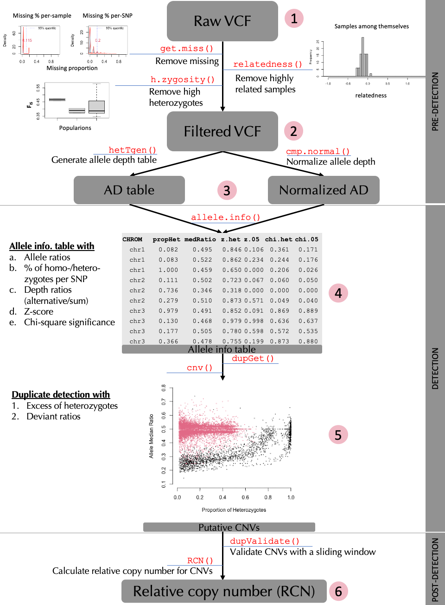
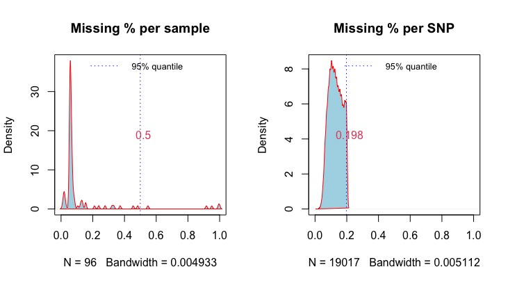
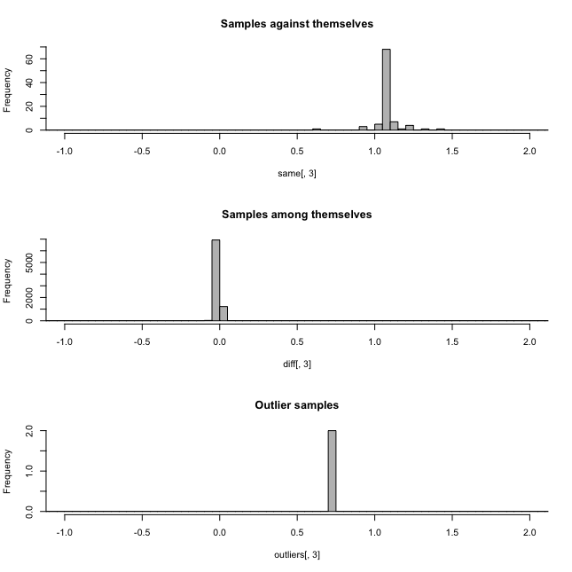
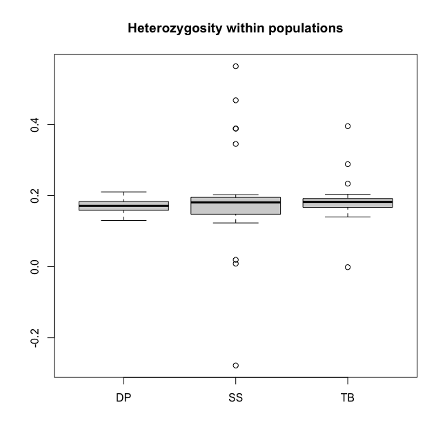
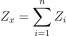
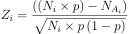
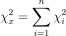
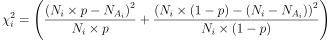
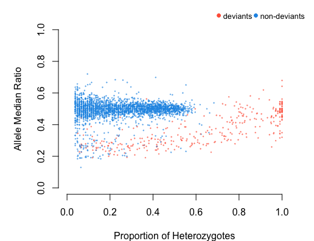
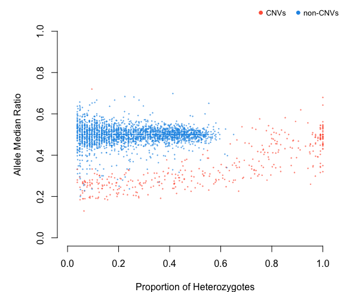

---
# rmarkdown::html_vignette
---

```{r, include = FALSE}
knitr::opts_chunk$set(
  collapse = TRUE,
  comment = "#>"
)
```

# **rCNV: An R package for detecting copy number variants from SNPs data**
`r rCNV:::colorize("Piyal Karunarathne, Qiujie Zhou, and Pascal Milesi","dodgerblue")`


This tutorial provides a complete guide to detecting CNVs from SNPs data using rCNV package. This includes importing raw VCF files, filtering them, normalization of read depth, categorization of SNPs into "deviants" and "non-deviants", and from which  SNPs located in putative CNV regions are filtered. A brief workflow is presented in Fig 1. below.

{width=400}

All the data used in this tutorial is available either withing the package or from the GitHub repository at <https://github.com/piyalkarum/rCNV/tree/master/testDATA>.

We provide here a complete workflow of detecting CNVs from SNPs, starting with raw (unfiltered) VCF as in the number 1 of the workflow chart. However, if one believes that they have filtered VCFs for the parameters we highlight (see Fig.1 and sub-sections 1.2 and 1.3), they can start from the number 2 in the workflow shown above.  
*NOTE*: In the latest iteration of the rCNV package, the functions `sig.hets()` and `dupGet()` use use a sample based inbreeding coefficient *(Fis)* to improve the accuracy of the deviant detection. This *Fis* is calculated using the `h.zygosity()` function; see below for more information. 

```{r, eval=FALSE}
# Start by installing the package if you haven't already done so.  
# To install the CRAN version
install.packages("rCNV")

# Or if you would like to install the development version of the package
if (!requireNamespace("devtools", quietly = TRUE)) 
    install.packages("devtools") 
devtools::install_github("piyalkarum/rCNV", build_vignettes = TRUE)
```

## 1. PRE-DETECTION
### 1.1 Importing data
|     Raw VCF files can be imported to rCNV R environment using the built-in function `readVCF()`. The imported vcf is stored as a data frame within a list. 

```{r, echo=TRUE,eval=TRUE}
library(rCNV)
vcf.file.path <- paste0(path.package("rCNV"), "/example.raw.vcf.gz")
vcf <- readVCF(vcf.file.path,verbose = FALSE)

# This imports an example VCF file included in the package
# The data is a partial dataset of Norway spruce data from Chen et al. 2019.
```
```{r,eval=FALSE}
#print the first 10 rows and columns of the imported VCF
vcf$vcf[1:10,1:10]
```
```{r, echo=FALSE, tidy=TRUE,tidy.opts=list(width.cutoff=60)}
vcf$vcf[1:6,c(1:7,9,10)]
```

### 1.2 Filtering VCF for missing data
|       The raw VCF files often contain missing data for both samples and SNPs. If retained, these samples and SNPs can introduce false positives and negatives to the analysis. Therefore, they must be removed based on a missing percentage. The function `get.miss()` determines the missing percentages in samples and SNPs and graphically visualize the missing ranges with 5% quantile values. We recommend removing samples and SNPs with missing percentages higher than 50%.
The following example demonstrates such filtering on Parrot Fish data from *Stockwell et al. (2016)*.

```{r,echo=TRUE,eval=TRUE,fig.dim=c(6,4)}
#download the parrotfish data (Stockwell et al. 2016) file from the following link to your working directory if you do not have the github folder
#https://github.com/piyalkarum/rCNV/blob/master/testDATA/Parrotfish_sequenceReads.vcf.gz
#and specify the path fl= to your file.
fl<-"../testDATA/Parrotfish_sequenceReads.vcf.gz"
parrot<-readVCF(fl,verbose=F)
mss<-get.miss(parrot,verbose = F, plot=F)
```

This generates a list with missing percentage tables for SNPs and samples and a plot similar to Fig 1.2 where missing percentages are plotted. Users can also manually plot these percentages on their discretion. Further, if desired one type of missing percentage (i.e. per sample or per SNP) can be calculated separately by specifying the argument `type=` in the `get.miss()` function. See the help page of `get.miss()` for more information.

{width=80%}
```{r}
head(mss$perSample)
```

The plot shows that there are several samples with missing data for more than 50% of the SNPs. It is recommended to remove these before proceeding with further analysis. Removing them from the imported vcf file is just a matter of obtaining the columns (samples) for which missing percentage if >50%.

```{r}
dim(parrot$vcf)
sam<-which(mss$perSample$f_miss>0.5)+9 #here we determine the sample columns with f_miss>0.5 and add 9 to get the correct column number because there are 9 more columns before the sample columns start.
parrot<-data.frame(parrot$vcf)[,-sam]
dim(parrot)
```
We have removed 5 samples that were undesired for the analysis due to their missing data.
Undesired SNPs can also be removed the same way; Note: now they are in rows.

### 1.3 Assessing the relatedness among samples and heterozygosity within

The function `relatedness()` in the rCNV package will generate the relatedness index between pairs of samples according to *Yang et al. (2010)*.
The output is a data frame with pairs of samples and the relatedness score *Ajk*. Please read *Yang et al. (2010)* for more information on the calculation of *Ajk*.

```{r,fig.dim=c(6,4),eval=FALSE}
rels<-relatedness(parrot)
head(rels)
```

From the relatedness plots, we can see that the relatedness in Parrot fish samples is low. We recommend removing one sample of the pairs with outlier values above 0.9.

{width=40%} {width=40%}

Figure 1.3. a. Relatedness among samples, b. Heterozygosity in Parrotfish populations

Heterozygosity within populations can be calculated using `h.zygosity()` function.  

|   * NOTE: A list of populations corresponding to the samples must be provided in order to plot the heterozygosity among populations.

```{r,eval=FALSE}
pops<-substr(colnames(parrot)[-c(1:9)],1,2) #population codes (the first two letters of the sample names)
hz<-h.zygosity(parrot,pops=pops)
head(hz)
```
In figure 1.3.b, we can see that most of the individuals has a mean heterozygosity F<sub>IS</sub> close to 0.19, except for a few outliers. However, outliers with an F<sub>IS</sub> value below -0.2 is highly likely DNA contamination. Therefore, it is recommended to remove such samples.

## 1.4 Generating allele depth tables and normalized depth values

Allele read depth table is the main data that will be used for the rest of the analysis. Therefore, having them generated and stored for later use will immensely save a lot of time. The function `hetTgen()` is especially dedicated for this purpose. Apart from generating filtered allele depth table for separate alleles (`info.type="AD"`), the function can also generate total allele depth (`info.type="AD-tot"`), genotype table (`info.type="GT"`), etc.. See the help page of `hetTgen()` for more formats.

```{r,eval=FALSE}
ad.tab<-hetTgen(parrot,info.type="AD")
ad.tab[1:10,1:6]
```

Table 1.4.0 Allele depth table (generated from a larger data set of Stockwell et al. 2016 Parrot fish data)
```{r,echo=FALSE}
knitr::kable(ADtable[1:6,1:6],format="html")
```

As an additional step, rCNV framework corrects allele depth values for genotype misclassifications (where genotype and the depth values do not match) and odd number anomalies (where total depth of a loci is odd).

```{r,eval=FALSE}
#the genotype table is needed for correcting the genotype mismatches
gt<-hetTgen(parrot,info.type = "GT")
ad.tab<-ad.correct(ad.tab,gt.table = gt)
```

It is recommended to normalize the allele depth values across samples in order to avoid the depth variation arise from sequencing heterogeneity where some samples tend to have higher depth values compared to others due to different origin of sequencing efforts.
We provide several methods for normalizing data.  
|       TMM = trimmed mean of M values
|       MedR = median ratio normalization
|       QN = quantile based normalization
|       pca = PCA based normalization

*Please read the function help for more information on the different methods  

```{r,eval=FALSE}
#normalize depth table with cpm.normal()
ad.nor<-cpm.normal(ad.tab,method="MedR")
ad.nor[1:6,1:6]
```

Table 1.4.1 Normalized allele depth table  
```{r, echo=FALSE,cache=FALSE}
ad.nor<-cpm.normal(ADtable,method="MedR",verbose = F, plot=F)
knitr::kable(ad.nor$AD[1:6,1:6],format = "html")
```
Compare the allele depth values between tables 1.4.0 and 1.4.1.

## 2. DETECTION
### 2.1 Generating allele information table
In this step, all the statistics necessary for detecting duplicates are calculated. They include the following:
a. Allele ratios (across all samples), b. Proportions of homo-/hetero-zygotes per SNP, c. Depth ratios (alternative/sum), d. Z-score, e. Chi-square significance, and f. excess of heterozygosity. 

`r rCNV:::colorize("[see section 2.4 for alternative detection statistics for whole genome sequencing (WGS) data]","red")`

Alternative allele ratio is calculated across all the samples from depth values; Proportion of homo/hetero-zygotes are also calculated across all the samples per SNP; Depth ratio is calculated per individual per SNP by dividing the alternative allele depth value by the total depth value of both alleles. This is calculated for both heterozygotes and homozygotes;  the Z-score per SNP is calculated according to the following equation:





Where *N<sub>i</sub>* is the total depth for heterozygote *i* at SNP *x*, *N<sub>Ai</sub>* is the alternative allele read depth for heterozygote *i* at SNP *x*,
*p* is the probability of sampling allele *A* in SNP *x* - for unbiased sequencing, this is *0.5*. The `allele.info()` function calculates this for both *0.5* and biased probability using the ratio between reference and alternative alleles.

The Chi-squared values per SNP per sample were calculated using the following equation:  


  


Where *N<sub>i</sub>* is the total depth for heterozygote *i* at SNP *x*, *N<sub>Ai</sub>* is the alternative allele read-depth for heterozygote *i* at SNP *x*, *p* is the probability of sampling allele *A* at SNP *x* in heterozygotes - in unbiased sequencing, this is *0.5*, *n* is the number of heterozygotes at SNP *x*.  

In addition to the above a-e parameters several other important statistics per sample per SNP is generated in the `allele.info()` output.  

```{r,eval=FALSE}
# in the new version of the package allele.info() and dupGet() functions require Fis value for a more accurate detection of the deviants
# this is obtained by using the h.zygosity() function as below
hz<-h.zygosity(parrot,verbose = FALSE) #parrot is the filtered vcf file
Fis<-mean(hz$Fis,na.rm = TRUE)
A.info<-allele.info(X=ADtable,x.norm = ADnorm, plot.allele.cov = TRUE,Fis=Fis)
# X is the corrected non-normalized allele depth table and x.norm is the normalized allele depth table
head(A.info)
```
```{r,echo=FALSE}
head(alleleINF)
```


### 2.2 Deviants detection

In this step, the allele information table generated in the previous step is used to detect deviant SNPs based on different models (statistics), which then is used in the next step with the appropriate test statistic to filter putative CNVs.
The rCNV function `dupGet()` delivers easy to pick model selection to detect deviant SNPs with a plotting option to visualize the detection.


```{r, eval=FALSE}
# Run this code for a demonstration of the detection
# Fis is calculated as before using h.zygosity()
dvs<-dupGet(alleleINF,test = c("z.05","chi.05"),Fis=0.11)
# z score and chi-square values given p=0.05 is used here because the data is RADseq generated and probe-biase is neglegible

head(dvs)
```


The detection of deviant SNPs is based on the **heterozygosity** within populations (or among all samples) and **allelic ratios** within such heterozygotes.
As such, `dupGet()` function implements three methods to flag the deviant alleles; They are a) Excess of heterozygotes, b) Heterozygous SNPs with depth values that do not follow normal Z-score distribution, and c) Heterozygous SNPs with depth values that do not follow normal chi-square distribution.

|   The proportion of heterozygotes in a population according to HWE is 2pq where as homozygotes is q<sup>2</sup>. In deviant SNPs heterozygosity is expected to be higher indicating excess of heterozygosity and thus flagged as deviant/putative-CNVs.

|   In non-duplicated alleles (non-CNVs), median allele ratio must be ~0.5, however, in deviants, it varies between 1:3 and 3:1. These SNP deviants are also flagged as putative CNVs. To determine the deviation, we use the Z-score values and Chi-square significance calculated in the previous step.

|   **NOTE: users can select the expected allele frequency (p: \code{test}) of the alternative allele based on the sequencing method and the probe bias therein. See our publication <https://doi.org/10.1101/2022.10.14.512217> for more details on probe bias.

```{r,eval=FALSE}
deviants<-dupGet(alleleINF,Fis=Fis,test = c("z.all","chi.all"),plot=TRUE,verbose = TRUE)
head(deviants)
```
```{r,echo=FALSE}
deviants<-dupGet(alleleINF,Fis=Fis,plot=FALSE,verbose = FALSE)
head(deviants)
```

The function also plots the deviants with Allele median ratio Vs Proportion of Heterozygotes to visualize and validate the detection by the user. Users can also plot the detection separately with the output of `dupGet()` using `dup.plot()` function.

{width=400}

### 2.3 Filtering putative CNVs
SNPs that are located in putative CNV regions are filtered using two methods; 1) intersection: using a combination of at least two statistics used in deviant detection. i.e., excess of heterozygotes, Z-score distribution and Chi-square distribution, 2) K-means: using an unsupervised clustering based on Z-score, chi-square, excess of heterozygotes, and coefficient of variation from read-depth dispersion. The significant SNPs from either of the `filtering` are flagged as putative duplicates. The users can pick a range of optimal statistics (e.g. `z.all`,`chi.all`,`z.05`,`chi.05`, etc.) depending on the nature (also sequencing technology) of the underlying data. The function `cnv()` is dedicated for this purpose.

```{r eval=FALSE}
CV<-cnv(alleleINF, test=c("z.05","chi.05"), filter = "kmeans")
# see the difference between deviants and duplicates
table(deviants$dup.stat)
table(CV$dup.stat)
```

{width=400}

```{r eval=TRUE,echo=FALSE}
CV<-cnv(alleleINF, test=c("z.05","chi.05"),verbose = F,plot = F)
# see the difference between deviants and duplicates
table(deviants$dup.stat)
table(CV$dup.stat)
```

### 2.4 Detection of multicopy regions from WGS data
**rCNV is currently developing methods to detect multicopy regions specifically dedicated to whole genome sequencing data using maximum likelihood ratios.** The following script demonstrates how this method can be used using SNP data sets of WGS data. *Stay tuned for more updates and a full description of the complete WGS CNV detection process.*

```{r eval=FALSE, echo=TRUE}
vcf<-readVCF("path/to/wgs/data.vcf")
fis<-mean(h.zygosity(vcf)$Fis)
gt<-hetTgen(vcf,"GT")
ad<-hetTgen(vcf,"AD")
ad[ad==""] <- "0,0"

out<-allele.info.WGS(ad,gt,fis)
# out is a data frame with duplication status of each snp, and other stats.

```


## 3. POST-DETECTION

### 3.1 Duplicate list and validation
We test the validity of detected duplicates in two ways: 1. direct detection through a sliding window and 2. variant fixation index

* The sliding window method assess the duplication along chromosomes/scaffolds on a given size (e.g., 10,000 bp) sliding window. This step assumes that ideally, if a locus is truly located in a multi-copy region, close-by SNPs should also be classified as deviants while deviation caused by sequencing error should be more scattered along the genome. The putative duplicates that do not follow this assumption will be flagged as low-confident and can be removed if desired. The function `dup.validate` in the rCNV package is dedicated to detecting regions enriched for deviant SNPs within a sliding window along a chromosome, scaffold, or a sequence of any given length.     
**Check the function example in the package for how to use it. Note that this method is still being tested**

* Variant fixation index ($V_{ST}$ : Redon et al. 2006) is analogous to population fixation index ($F_{ST}$) and calculated as $V_{ST} = V_S/V_T$ where $V_T$ is the variance of normalized read depths among all individuals from the two populations and VS is the average of the variance within each population, weighed for population size; and used to identify distinct CNV groups between populations (See Dennis et al., 2017; Weir & Cockerham, 1984)
The function `vst` can be used to calculate the $V_{ST}$ values per population and plot genetic distance in a network qgraph.

```{r,eval=FALSE}
# the dataset used here is from Dorrant et al. 2020 of American lobster populations in Gulf of St. Lawrence, Canada
vdata<-readRDS("../testDATA/lobster_data4Vst.rds")
# get the total depth values of the duplicated snps
# You can either use the following line to get the total depth of the samples or use the "tot" option of the hetTgen function to generate the total depth table
dd<-rCNV:::apply_pb(vdata[,-c(1:4)],2,function(x){do.call(cbind,lapply(x,function(y){sum(as.numeric(unlist(strsplit(as.character(y),","))))}))})
pops<-substr(colnames(dd),1,4)
dd<-data.frame(vdata[,1:4],dd)
Vs<-vst(dd,pops=pops)
```
```{r,echo=FALSE}
vdata<-readRDS("../testDATA/lobster_vstDat.rds")
dd<-apply(vdata[,-c(1:4)],2,function(x){do.call(cbind,lapply(x,function(y){sum(as.numeric(unlist(strsplit(as.character(y),","))))}))})
pops<-substr(colnames(dd),1,4)
dd<-data.frame(vdata[,1:4],dd)
Vs<-vst(dd,pops=pops,verbose=F)
```
Fig. 3.1. Vst network qgraph generated from the Vst values for each lobster population. Circles represent populations and the green arrows show similarity and the direction.See `qgraph` help for the interpretation of the network analysis.  

NOTE: You can also run a permutation test (using `vstPermutation`) on the vst calculation to test the randomness of the vst.

### 3.2 Relative copy number
TBA

## 4. References

* Chen, J., Li, L., Milesi, P., Jansson, G., Berlin, M., Karlsson, B., … Lascoux, M. (2019). Genomic data provide new insights on the demographic history and the extent of recent material transfers in Norway spruce. Evolutionary Applications, 12(8), 1539–1551. doi: 10.1111/eva.12801

* Dorant, Y., Cayuela, H., Wellband, K., Laporte, M., Rougemont, Q., Mérot, C., … Bernatchez, L. (2020). Copy number variants outperform SNPs to reveal genotype–temperature association in a marine species. Molecular Ecology, 29(24), 4765–4782. doi: 10.1111/mec.15565

* Karunarathne P, Zhou Q, Schliep K, Milesi P. A comprehensive framework for detecting copy number variants from single nucleotide polymorphism data: 'rCNV', a versatile r package for paralogue and CNV detection. Mol Ecol Resour. 2023 Jul 29. doi: 10.1111/1755-0998.13843

* Karunarathne, P., Zhou, Q., Schliep, K., & Milesi, P. (2022). A new framework for detecting copy number variants from single nucleotide polymorphism data: ‘rCNV’, a versatile R package for paralogs and CNVs detection. BioRxiv, 2022.10.14.512217. doi: 10.1101/2022.10.14.512217  

* Redon, R., Ishikawa, S., Fitch, K. R., Feuk, L., Perry, G. H., Andrews, T. D., … Chen, W. (2006). Global variation in copy number in the human genome. Nature, 444(7118), 444–454.

* Stockwell, B. L., Larson, W. A., Waples, R. K., Abesamis, R. A., Seeb, L. W., & Carpenter, K. E. (2016). The application of genomics to inform conservation of a functionally important reef fish (Scarus niger) in the Philippines. Conservation Genetics, 17(1), 239–249  

* Yang, J., Benyamin, B., McEvoy, B. P., Gordon, S., Henders, A. K., Nyholt, D. R., … Visscher, P. M. (2010). Common SNPs explain a large proportion of the heritability for human height. Nature Genetics, 42(7), 565–569. doi: 10.1038/ng.608  


