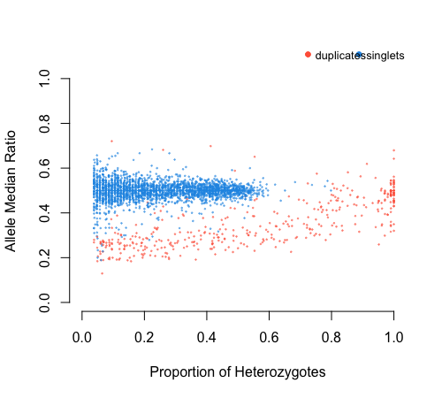

```{r, include = FALSE}
knitr::opts_chunk$set(
  collapse = TRUE,
  comment = "#>"
)
```

# **rCNV: An R package for detecting copy number variants from SNPs data**
`r rCNV:::colorize("Piyal Karunarathne, Qiujie Zhou, and Pascal Milesi","dodgerblue")`


This tutorial will provide and A-Z guide to detecting CNVs from SNPs data using rCNV package. This includes importing raw VCF files, filtering VCFs, normalization of read depth, categorization of SNPs into "duplicates" and "singlets". A brief workflow is presented in Fig 1. below.

{width=400}

All the data used in this tutorial is available either withing the package or from the GitHub repository at **link**.

We provide here a complete workflow of detecting CNVs from SNPs, starting with raw (unfiltered) VCF as in the number 1 of the workflow chart. However, if one believes that they have filtered VCFs for the parameters we've mentioned (see Fig.1 and sub-sections 1.2 and 1.3), they can start from the number 2 in the workflow shown above.

## 1. PRE-DETECTION
### 1.1 Importing data
|     Raw VCF files can be imported to rCNV R environment using the built-in function *readVCF()*. The imported vcf is stored as a data frame within a list. 
```{r, eval=FALSE}
# Start by installing the package if you haven't already done so.
if (!requireNamespace("devtools", quietly = TRUE)) 
    install.packages("devtools") 
devtools::install_github("piyalkarum/rCNV", build_vignettes = TRUE)
```

```{r, echo=T,eval=TRUE}
library(rCNV)
vcf.file.path <- paste0(path.package("rCNV"), "/example.raw.vcf.gz")
vcf <- readVCF(vcf.file.path,verbose = FALSE)
```
```{r,eval=FALSE}
#print the first 10 rows and columns of the imported VCF
vcf$vcf[1:10,1:10]
```
```{r, echo=FALSE, tidy=TRUE,tidy.opts=list(width.cutoff=60)}
vcf$vcf[1:6,c(1:7,9,10)]
```

### 1.2 Filtering VCF for missing data
|       The raw VCF files often contain missing data for both samples and SNPs. If retained, these samples and SNPs can introduce false positives and negatives to the analysis. Therefore, they must be removed based on a missing percentage. The function *get.miss()* determines the missing percentages in samples and SNPs and graphically visualize the missing ranges with 5% quantile values. We recommend removing samples and SNPs with missing percentages higher than 50%.
The following example demonstrates such filtering on Parrot Fish data from *McKinney et al. (2017)*.

```{r,echo=TRUE,eval=TRUE,fig.dim=c(6,4)}
parrot<-readVCF("../testDATA/Parrotfish_sequenceReads.vcf",verbose=F)
mss<-get.miss(parrot,verbose = F, plot=F)
```
This generates list with missing percentage tables for SNPs and samples and the Fig 1.2 where missing percentages are plotted. Users can also manually plot these percentages on their discretion. Further, if desired one type of missing percentage (i.e. per sample or per SNP) can calculated separately by specifying the argument *type=* in the *get.miss* function. See the help page of *get.miss* for more information.

{width=80%}
```{r}
head(mss$perSample)
```

The plot shows that there are several samples with missing data for more than 50% of the SNPs. It is recommended to remove these before proceeding with further analysis. Removing them from the imported vcf file is just a matter of obtaining the columns (samples) for which missing percentage if >50%.

```{r}
dim(parrot$vcf)
sam<-which(mss$perSample$f_miss>0.5)+9 #here we determine the sample columns with f_miss>0.5 and add 9 to get the correct column number
parrot<-data.frame(parrot$vcf)[,-sam]
dim(parrot)
```
We have removed 5 samples that were undesired for the analysis due to their missing data.
Undesired SNPs can also be removed the same way; Hint: now they are in rows.

### 1.3 Assessing the relatedness among samples and heterozygosity withing

The function *relatedness()* in the rCNV package will generate the relatedness index between pairs of samples according to *Yang et al. (2010)*.
The output is a data frame with pairs of samples and the relatedness score *Ajk*. Please read *Yang et al. (2010)* for more information on the calculation of *Ajk*.

```{r,fig.dim=c(6,4),eval=FALSE}
rels<-relatedness(parrot)
head(rels)
```

From the relatedness plots, we can see that the relatedness in Parrot fish samples is low. We recommend removing one sample of the pairs with outlier values above 0.9.

{width=40%} {width=40%}

Figure 1.3.a Relatedness among samples,b Heterozygosity in Parrotfish populations

Heterozygosity within populations can be calclated using *h.zygosity()* function.
|   * NOTE: A list of populations corresponding to the samples must be provided in order to plot the heterozygosity among populations.

```{r,eval=FALSE}
pops<-substr(colnames(parrot)[-c(1:9)],1,2) #population codes (the first two letters of the sample names)
hz<-h.zygosity(parrot,pops=pops)
head(hz)
```
In figure 1.3.b, we can see that most of the individuals has a mean heterozygosity (Fis) close to 1.9, except for a few outliers. However, outliers with a Fis value below -0.2 is highly likely DNA contamination. Therefore, it is recommended to remove such samples.

## 1.4 Generating allele depth tables and normalized depth values

Allele read depth table is the main data set that will be used for the rest of the analysis. Therefore, having them generated and stored for later use will immensely save a lot of time. The function *hetTgen()* is especially dedicated for this purpose. Apart from generating filtered allele depth table for separate alleles (info.type="AD"), the function can also generate total allele depth (info.type="AD-tot"), genotype table (info.type="GT"), etc.. See the help page of *hetTgen()* for more formats.

```{r,eval=FALSE}
ad.tab<-hetTgen(parrot,info.type="AD")
ad.tab[1:10,1:6]
```

Table 1.4.0 Allele depth table (generated from a different data set than parrotfish data)
```{r,echo=FALSE}
knitr::kable(ADtable[1:6,1:6],format="html")
```

```{r,eval=FALSE}
#normalize depth table with cpm.normal()
ad.nor<-cpm.normal(ad.tab)
ad.nor[1:6,1:6]
```
Table 1.4.1 Normalized allele depth table
```{r, echo=FALSE,cache=FALSE}
ad.nor<-cpm.normal(ADtable,verbose = F)
knitr::kable(ad.nor[1:6,1:6],format = "html")
```
Compare the allele depth values between tables 1.4.0 and 1.4.1.

## 2. DETECTION
### 2.1 Generating allele information table
In this step, all the statistics necessary for detecting duplicates are calculated. They include the following:
a. Allele ratios (across all samples), b. Proportions of homo-/heterozygotes per SNP, c. Depth ratios (alternative/sum), d. Z-score, e. Chi-square significance

Alternative allele ratio is calculated across all the samples from depth values;Proportion of homo/hetero-zygotes are also calculated all the samples per SNP; Depth ratio is calculated per individual per SNP by dividing the alternative allele depth value by the sum depth value of both alleles. This is calculated for both heterozygotes and homozygotes; Z-score per SNP is calculated according to the following equation:


Where N is the total depth summed for all heterozygotes, N<sub>A</sub> is the depth of allele A summed for all the heterozygotes,
*P* is the occurrence probability of allele A in heterozygotes - for unbiased sequencing this is 0.5. *allele.info()* function calculates this for both 0.5 and biased probability using the ratio between reference and alternative alleles.

The Chi-squared values per SNP per sample were calculated using the following equation:


Where *N<sub>jk</sub>* is the total depth value of SNP *k* for individual *j*, *D<sub>jk</sub>* is the depth value of the alternative allele of SNP *k*, *P<sub>j</sub>* is the occurrence probability of alternative allele at SNP *k* in heterozygotes - in unbiased sequencing, this is 0.5.  

```{r,eval=FALSE}
A.info<-allele.info(ADtable, plot.allele.cov = TRUE)
head(A.info)
```
```{r,echo=FALSE}
head(alleleINF)
```

In addition to the above a-e parameters several other important statistics per sample per SNP is generated in the *allele.info()* output. See below.
ADD MORE ABOUT THE PROBE BIASE PLOTS****

### 2.2 Duplicate detection

In this step, we use the allele information table generated in the previous step to detect duplicated SNPs based different models.
The rCNV function *dupGet()* delivers easy to pick model selections to detect the duplicates with a plotting (similar to HD plots in *McKinney et al. 2017*) option to visualize the detection.

The detection of duplicates is based on the **heterozygosity** within populations (or among all samples) and **allelic ratios** within such heterozygotes.
As such, *dupGet()* function implements two methods to flag the duplicated alleles; They are a) Excess of heterozygotes and b) SNP deviants.

|   The proportion of heterozygotes in a population according to HWE is 2pq where as homozygotes is q<sup>2</sup>. In duplicates heterozygozity is expected to be higher indicating excess of heterozygosity and thus flagged as putatively-duplicated.

|   In non-duplicated alleles (singlets), median allele ratio must be ~0.5, however, in duplicates it varies between 1:3 and 3:1. These SNP deviants are also flagged as putative duplicates. To determine the deviation, we use the Z-score values and Chi-square significance calculated in the previous step.

|   **NOTE: users can select the occurrence probability of the alternative allele based on the sequencing method and the probe bias therein. 

```{r,eval=FALSE}
duplicates<-dupGet(alleleINF,test = c("z.all","chi.all"),plot=TRUE,verbose = TRUE)
head(duplicates)
```
```{r,echo=FALSE}
duplicates<-dupGet(alleleINF,plot=FALSE,verbose = FALSE)
head(duplicates)
```

The function also plots the putative duplicates with Allele median ratio Vs Proportion of Heterozygotes to visualize and validate the detection by the user. Users can also plot the detection separately with the output of *dupGet()* using *dup.plot()* fucntion.

{width=400}


## 3. POST-DETECTION
|       TBA
### 3.1 Duplicate list and validation

### 3.2 Relative copy number


